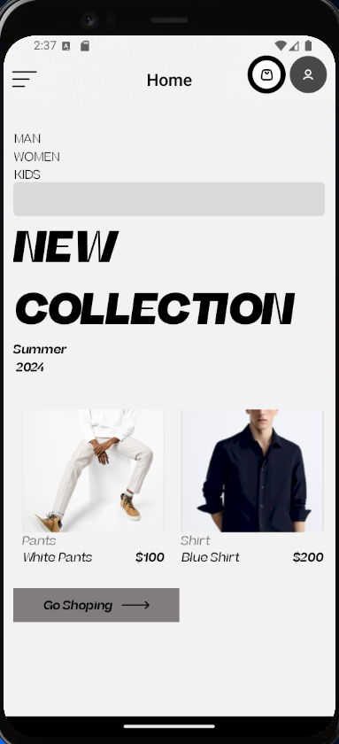
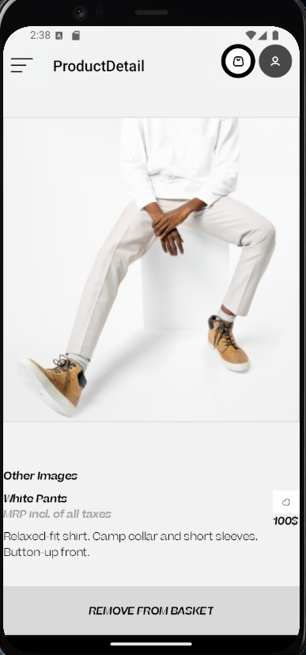

# Moda Mağazası | E-ticaret Uygulaması | React Native

Bu depo, **React Native ile geliştirilmiş bir Moda Mağazası E-ticaret Uygulaması** içermektedir. Uygulama, bir giyim mağazası için tamamen işlevsel bir e-ticaret çözümü sunar. Kullanıcılar ürünleri görüntüleyebilir, sepete ekleyebilir, ürün miktarlarını değiştirebilir ve satın alma işlemleri gerçekleştirebilirler. Ayrıca, kullanıcı profili yönetimi ve favori ürünler gibi özellikler de mevcuttur.

## Ekran Görüntüleri

  
  
  

## Figma Tasarımı

[Figma Tasarımını Görüntüle](https://www.figma.com/design/D3LjmWvmeGI9VjRIrStQ5a/Cloth-Store-%7C-Fashion-Store-%7C-E-commerce-UI-Kit-(Community)?node-id=0-1&node-type=canvas&t=HFCWgJolhCerSULb-0)

